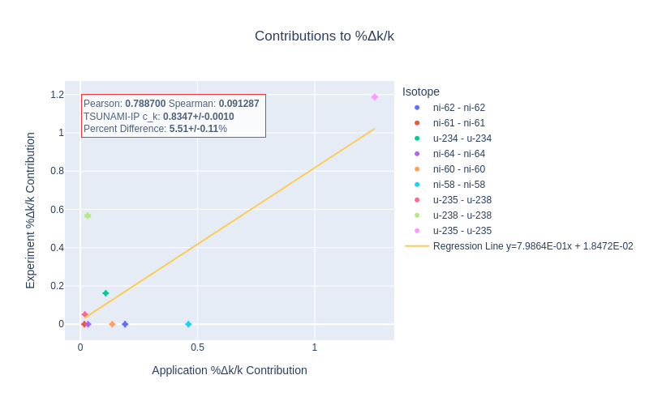
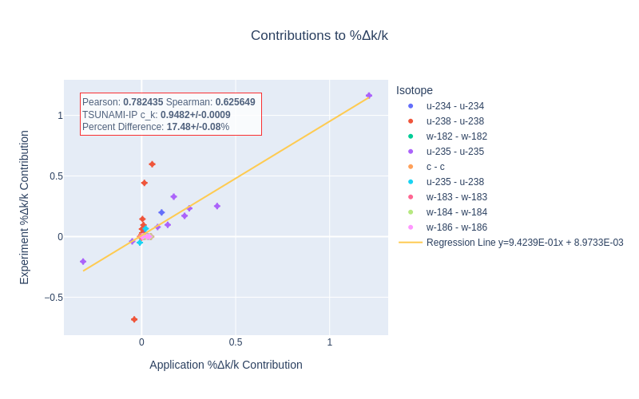
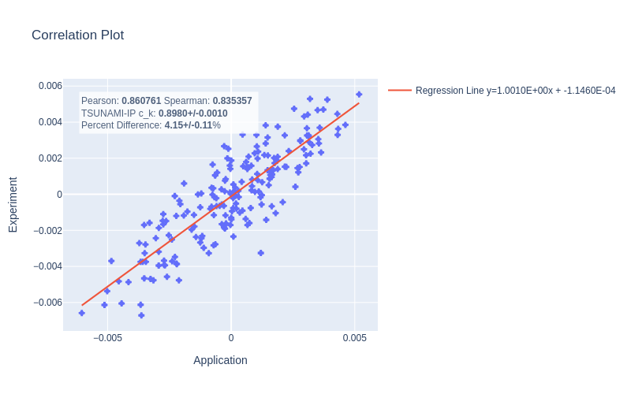
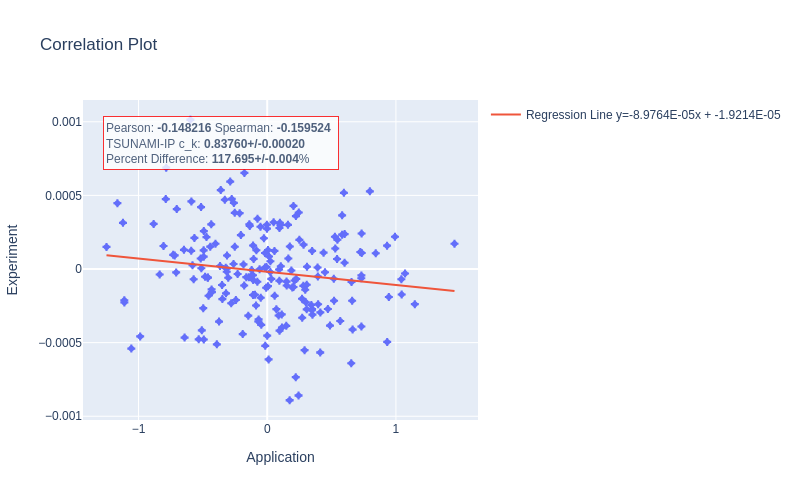

==================================================================
Investigation of Correlation Methods for use in Criticality Safety
==================================================================

:Author: Matthew Louis
:Author: Alex Lang
:Author: Walid Metwally

Background
==========

In the field of criticality safety, computational methods are used for
ensuring subcriticality for processes under normal and credible abnormal
conditions. To ensure that these computational methods for ensuring
operational safety are reliable, they must be rigorously validated
against physical experiments. The American National Institute of
Standards (ANSI) outlines the procedure for code validation for
criticality safety in ANSI/ANS-8.1 :cite:p:`bowen2008ansi`.
The standard requires that the computational bias for a particular
application is well quantified by comparison with experiments within
some *range of applicability*. The standard defines the range of
applicability as “the limiting ranges of material compositions,
geometric arrangements, neutron energy spectra, and other relevant
parameters  e.g., heterogeneity, leakage, interaction, absorption, etc.
within which the bias of a computational method is
established” :cite:p:`bowen2008ansi` For systems that may lack
applicable experiments entirely (e.g., UF\ :sub:`6` transportation
cylinders :cite:p:`osti_1797631`), the standard allows for
using trends in the bias to extend the experimental data to the
application system.

Historically, this bias trending has required expert judgement about
which system characteristics should be used for defining similarity for
the trending analysis (neutron spectrum, fuel enrichment, etc.). A key
development was the introduction of quantitative similarity metrics
based on system sensitivity and nuclear data–induced
uncertainty :cite:p:`broadhead2004sensitivity`. The conjecture
is that systems will have similar biases if they have similar
sensitivity/uncertainty profiles (on a nuclide-reaction group-wise
level) because it is thought that the bias is primarily the result of
uncertainties in the underlying nuclear data. These similarity indices
can then be used with bias trending analysis tools like those provided
by the SCALE code sequence VADER :cite:p:`hart2022creation` to
provide a quantitative physics–based method for estimating computational
bias that does not rely on expert judgement.

Important Similarity Indices
----------------------------

Of the several similarity indices defined by Broadhead et al.,
:cite:p:`broadhead2004sensitivity` the two prominent indices
available in SCALE are :math:`E` and
:math:`c_k` :cite:p:`osti_1959594`.

The Sensitivity-Based Similarity Index: :math:`E`
~~~~~~~~~~~~~~~~~~~~~~~~~~~~~~~~~~~~~~~~~~~~~~~~~

The integral index :math:`E` is defined solely in terms of the
sensitivity profiles (i.e., the set of group-wise :math:`k_{\text{eff}}`
sensitivities for each nuclide-reaction pair), which may be calculated
using standard methods like Contributon-Linked eigenvalue
sensitivity/uncertainty estimation via Tracklength importance
Characterization (CLUTCH), :cite:p:`perfetti2012advanced`
Iterated Fission
Probability, :cite:p:`hurwitz1948note, kiedrowski2009adjoint`
direct perturbation, and others. Most of these methods are implemented
in SCALE’s TSUNAMI-3D
sequence :cite:p:`marshall2020review, perfetti2015scale`. It
was thought that if two systems are similar, their eigenvalue response
to perturbations in input nuclear data, or their sensitivity profiles,
should be similar. The integral index :math:`E` was designed to automate
the (often) manual comparisons of sensitivity profiles for *each*
nuclide reaction. To compute an integral index, the sensitivity profiles
of two arbitrary systems, A and B, are formed as vectors (where zero
sensitivities are assigned to missing nuclides or reactions so that the
vectors have compatible lengths) :math:`\boldsymbol{S}_A` and
:math:`\boldsymbol{S}_B`, and their normalized vector dot product is
taken to be the degree of similarity between system A and system B:

.. math::

   \begin{split}
           E &= \frac{\boldsymbol{S}_A\cdot \boldsymbol{S}_B}{\left\lVert\boldsymbol{S}_A\right\rVert\left\lVert\boldsymbol{S}_B\right\rVert}\nonumber.
       \end{split}

:math:`E` is not typically used when predicting bias, however, as it
does not incorporate the nuclear data uncertainty. While shared
sensitivity to nuclear data indicates an experiment may be applicable,
it is not the best predictor of computational bias, which is driven by
nuclear data induced uncertainty.

The Uncertainty-Based Similarity Index: :math:`c_k`
~~~~~~~~~~~~~~~~~~~~~~~~~~~~~~~~~~~~~~~~~~~~~~~~~~~

The most widely used similarity index in criticality safety is
:math:`c_k`. It represents the degree to which nuclear data–induced
uncertainties in :math:`k_{\text{eff}}` are correlated between two
systems :cite:p:`broadhead2004sensitivity`. The :math:`c_k`
similarity index between systems A and B is given by

.. math::
   :label: eq-ck

   \label{eq-ck}
       \begin{split}
           c_k &= \frac{\boldsymbol{S}_A\boldsymbol{C}_{\alpha, \alpha}\boldsymbol{S}_B^T}{\sqrt{\left(\boldsymbol{S}_A\boldsymbol{C}_{\alpha, \alpha}\boldsymbol{S}_A^T\right)\left(\boldsymbol{S}_B\boldsymbol{C}_{\alpha, \alpha}\boldsymbol{S}_B^T\right)}},
       \end{split}

where :math:`\boldsymbol{S}_A` and :math:`\boldsymbol{S}_B` are
respectively the sensitivity (row) vectors each of length
:math:`M=G\times P`, where :math:`P` represents the total number of
(unique) nuclide reaction pairs in the system and application, :math:`G`
is the number of energy groups, and
:math:`\boldsymbol{C}_{\alpha, \alpha}` is the nuclear data covariance
matrix (with shape :math:`M\times M`) defined by

.. math::

   \begin{split}
           \left(\boldsymbol{C}_{\alpha,\alpha}\right)_{ij} &= \text{Cov}\left(\sigma_i, \sigma_j\right)\nonumber 
       \end{split},

where :math:`\sigma_i` represents a single group-wise cross section for
a given nuclide-reaction pair and is the smallest unit of nuclear data
in a multigroup library. The denominator serves as a normalization
factor to ensure that if :math:`\boldsymbol{S}_A=\boldsymbol{S}_B` when
:math:`c_k=1`, and if :math:`\boldsymbol{S}_A=-\boldsymbol{S}_B`, then
:math:`c_k=-1`. This definition is aesthetically similar to that of
Pearson’s correlation coefficient between two random variables :math:`X`
and :math:`Y`, as in Eq. :eq:`eq-pearson`. The only
caveat is that the nuclear data covariance matrices can sometimes be
problematic :cite:p:`osti_950002` and lead to nonphysical
results unless certain heuristic rules are applied (i.e., those in the
:math:`\texttt{cov\_fix}` option) :cite:p:`osti_1959594`.
Furthermore there are concerns about the presence of unevaluated
cross-section covariances and their impact on
similarity :cite:p:`osti_950002`.

Bias Estimation and Acceptance Criteria
---------------------------------------

When estimating the computational bias using techniques like the
Generalized Linear Least Squares method (GLLSM), or other bias
estimation tools with similarity parameters like :math:`c_k`, a cutoff
is generally chosen for the similarity index below which experiments are
not included in the bias estimation. From an intuitive perspective, it
is unreasonable to expect that experiments that are very dissimilar to
the application would provide a useful estimation of the bias, so a
cutoff of some sort is necessary. For thermal systems, parametric
studies have been performed over the cutoff, and the cutoffs that were
found to minimize the bias error were
identified :cite:p:`broadhead2004sensitivity`. In addition, the
number of experiments needed to obtain a given confidence in the
estimated bias was also explored. From these considerations, a
:math:`c_k` cutoff of :math:`0.9` was chosen as a general
recommendation :cite:p:`broadhead2004sensitivity` and is
commonly used in regulatory
guidance, :cite:p:`scaglione2014approach` but lower :math:`c_k`
cutoffs can be used, although they require more experiments to achieve
the same confidence in the estimated bias. These criteria are a general
heuristic, and optimal :math:`c_k` cutoffs depend on the physical
parameters of the system and the chosen validation suite as well.

Practical Issues with the Application of Similarity Indices
===========================================================

For many low-enriched, light water applications, the prescriptive
:math:`c_k\geq 0.9` is not prohibitive, and it allows the practitioner
sufficient flexibility when selecting a suite of experiments for code
validation. However, the recent interest in high-assay low-enriched
uranium (HALEU) has required designing systems (mainly for
transportation) for which there is a general lack of applicable
experiments :cite:p:`fassino2024current`. For these
applications, practitioners are required to make an estimation of the
computational bias, despite having few or no experiments with
:math:`c_k\geq 0.9`. As discussed, there is a complex relationship
between the :math:`c_k` of included experiments, the number of included
experiments, and the quality of the estimated computational bias, so it
is not immediately clear how to select experiment suites in these cases.
Can practitioners lower the :math:`c_k` threshold to get more applicable
experiments to achieve a better estimate of the bias, or would including
dissimilar experiments provide a poor estimate of the bias and/or
violate the assumptions of the bias trending method? Is the heuristic
guidance for the :math:`c_k` threshold even applicable in this case?

To address these questions, a better understanding of how the underlying
nuclear data influences the calculated :math:`c_k` could be useful.
Broadhead et al. provide a means for calculating the contributions to
:math:`c_k` on a nuclide- and reaction-specific basis, which can be
helpful when determining which nuclides and reactions are driving
similarity or dissimilarity. Examination of these contributions can be
descriptive and can help inform experiment design because relevant
dissimilar isotopes and reactions can be readily identified. As an
exploratory effort, other ways of visually representing the
contributions to :math:`c_k` were explored.

.. _sec-a-correlation-based-approach:

A Correlation Based Approach
============================

To aid in understanding the contributions of individual sensitivities
and nuclear data uncertainties necessary in the computation of Eq.
`[eq-ck] <#eq-ck>`__, visualization tools can be used to graphically
inspect the contributors to the integral value. This approach would
allow practitioners to interpret the similarity between two systems as
the degree to which they are correlated and would allow outliers to be
easily identified. In addition, other traditional statistical measures
of correlation could be used to asses similarity, such as the Spearman
or Kendall rank correlation coefficient, which give different weights to
various aspects of the constituent datasets, and they could also be
useful as similarity indices, though these applications are not explored
in this work.

.. _sec-correlation-coefficient:

The Correlation Coefficient
---------------------------

Pearson’s Coefficient
~~~~~~~~~~~~~~~~~~~~~

The Pearson correlation coefficient between two random variables
:math:`X` and :math:`Y` is given by

.. math::
   :label: eq-pearson

   \label{eq-pearson}
       \begin{split}
           \rho_{X,Y} = \frac{\text{Cov}\left(X, Y\right)}{\sqrt{\text{Var}\left(X\right)\text{Var}\left(Y\right)}}
       \end{split}.

For a sample of a discrete number (:math:`N`) of points
:math:`(x_i,y_i)`, the sample Pearson correlation coefficient,
:math:`r_{xy}` may be computed using the sample variances/covariances
using

.. math::
   :label: eq-sample-pearson

   \label{eq-sample-pearson}
       \begin{split}
           r_{xy} &= \frac{\sum_{i=1}^N\left(x_i-\overline{x}\right)\left(y_i-\overline{y}\right)}{\sqrt{\left(\sum_{i=1}^N\left(x_i - \overline{x}\right)^2\right)\left(\sum_{i=1}^N\left(y_i - \overline{y}\right)^2\right)}}
       \end{split},

which was used in both the isotope-wise and isotope-reaction–wise
calculations. Although common, this estimator often provides a biased
estimate of the (population) correlation coefficient. The sampling
distribution of this sample statistic is complicated, involving the
gamma function and hypergeometric
functions, :cite:p:`hotelling1951impact, hotelling1953new` and
it often results in skewed distributions that can be corrected for with
sophisticated estimators :cite:p:`gnambs2023brief`. However,
the effect of the bias is not significant with a large number of
samples. This sampling distribution can also be used to derive an
estimator for the standard deviation of the (estimated) Pearson
correlation coefficient, :math:`\sigma_r`, for which an approximate
expression :cite:p:`gnambs2023brief` is given by

.. math::
   :label: eq-pearson-stddev

   \label{eq-pearson-stddev}
       \sigma_r\approx \frac{1-\rho^2}{\sqrt{N-3}}.

Spearman’s Coefficient
~~~~~~~~~~~~~~~~~~~~~~

Spearman’s correlation coefficient is the Pearson correlation
coefficient of the rank variables. Explicitly,

.. math:: r_s = \rho_{R(X), R(Y)} = \frac{\text{Cov}\left(R(X), R(Y)\right)}{\sqrt{\text{Var}\left(R(X)\right)\text{Var}\left(R(Y)\right)}}\nonumber.

For a discrete sample, the data-points :math:`x_i` and :math:`y_i` are
first ranked (i.e., sorted by magnitude), and then Eq.
:eq:`eq-sample-pearson` is used to compute the
sample Spearman correlation coefficient. This measure of correlation is
nonparametric, and it assesses the presence of *any* relationship
between two variables that can be expressed in terms of a monotonic
function, whereas Pearson’s correlation coefficient only expresses
linear relationships between the data. This measure of correlation is
useful for measuring nonlinear relationships between data and/or for
data with large outliers: it gives less weight than does Pearson’s
coefficient because each outlier is limited to its rank.

Correlating the :math:`\sigma_k` Contributions
----------------------------------------------

From a conceptual level, :math:`c_k` is a measure of the degree to which
the contributions to the nuclear data–induced uncertainty (on a
nuclide-reaction and group-wise basis) between two systems are similar,
so it was thought that the appropriate bivariate dataset (whose Pearson
correlation coefficient would equal the corresponding :math:`c_k`)
should be the nuclide-reaction group-wise nuclear data uncertainty
contributions. Because of the difficulty of extracting group-wise
nuclear covariance data from AMPX
libraries, :cite:p:`wiarda2016ampx` first nuclide-wise and then
nuclide reaction– wise contributions were considered.

Defining the :math:`\sigma_k^2` Contributions
~~~~~~~~~~~~~~~~~~~~~~~~~~~~~~~~~~~~~~~~~~~~~

The total nuclear data–induced variance in the criticality eigenvalue
:math:`\sigma_k^2` for a system A is given by

.. math::
   :label: eq-sigmaksq

   \label{eq-sigmaksq}
   \begin{split}
        \sigma_k^2 = \boldsymbol{S}_A \boldsymbol{C}_{\alpha,\alpha}\boldsymbol{S}_A^T\nonumber
    \end{split}.

The total nuclear data induced variance can be divided into
contributions from each cross-section covariance via

.. math::
   :label: eq-sigmaksq-nuclide-reaction

   \label{eq-sigmaksq-nuclide-reaction}
       \begin{split}
           \sigma_{k^{i,j}_{x,y}}^2 &= \boldsymbol{S}_{k_{x}^{i}} \boldsymbol{C}_{\alpha_x^k,\alpha_y^j}\boldsymbol{S}_{k_y^j}^T
       \end{split},

where :math:`i, j` are varied over all isotopes, and :math:`x,y` are
varied over all reactions. :math:`\sigma_{k_{x,y}^{ij}}^2` is read as
“the contribution to the variance in :math:`k` due to the cross section
covariance between :math:`\alpha_x^i` and :math:`\alpha_y^j` (i.e.,
nuclide :math:`i` reaction :math:`x` and nuclide :math:`j` reaction
:math:`y`.” These nuclide reaction–wise contributions to the nuclear
data–induced variance in :math:`k` can be summed to produce the total
variance in :math:`k`:

.. math::
   :label: eq-variance-k-sum

   \label{eq-variance-k-sum}
       \sigma_k^2 = \sum_{i,j,x,y}\sigma_{k^{i,j}_{x,y}}^2,

where the number of cross-section covariances is :math:`P^2\equiv N`.
Now, because :math:`\boldsymbol{C}_{\alpha,\alpha}` is positive
semi-definite by virtue of being a correlation matrix, the quantity
:math:`\sigma_k^2 \geq 0`, as expected of a variance. In addition, the
contribution to the nuclear data–induced variance from self-covariances
(i.e., covariance between a nuclide reaction and itself) is also
nonegative, because :math:`\boldsymbol{C}_{\alpha_x^k, \alpha_x^k}` is a
principle submatrix of :math:`\boldsymbol{C}_{\alpha, \alpha}` and is
therefore positive semi-definite, as well. This is not necessarily true
for cross covariances, where :math:`\alpha_x^k\neq \alpha_y^j`, so they
may be and often are
*negative* :cite:p:`broadhead1999sensitivity`. Strictly
speaking, because they are possibly negative, these contributions to the
variance cannot be viewed as variances, even though they are denoted by
:math:`\sigma_{k_{x,y}^{i,j}}^2`. Instead, they are more akin to
covariances, and they express anitcorrelations that tend to lower the
overall nuclear data–induced variance.

Defining the :math:`\sigma_k` Contributions
~~~~~~~~~~~~~~~~~~~~~~~~~~~~~~~~~~~~~~~~~~~

The total nuclear data–induced standard deviation in the criticality
eigenvalue can be easily calculated by taking the square root of the
variance:

.. math::
   :label: eq-sigmak

   \label{eq-sigmak}
       \begin{split}
           \sigma_k &= \sqrt{\sigma_k^2} = \sqrt{\boldsymbol{S}_A \boldsymbol{C}_{\alpha,\alpha}\boldsymbol{S}_A^T}
       \end{split}.

Likewise, the contributions to the standard deviation can be calculated
by taking the square root of the :math:`\sigma_k^2` contributions:

.. math::
   :label: eq-sigmak-nuclide-reaction

   \label{eq-sigmak-nuclide-reaction}
       \begin{split}
           \sigma_{k^{i,j}_{x,y}} &= \sqrt{\boldsymbol{S}_{k_{x}^{i}} \boldsymbol{C}_{\alpha_x^k,\alpha_y^j}\boldsymbol{S}_{k_y^j}^T}
       \end{split},

and the total standard deviation can be produced using usual rules for
combining standard deviations:

.. math::

   \begin{split}
           \sigma_k &= \sqrt{ \sum_{i,j,x,y}\sigma_{k^{i,j}_{x,y}}^2}\nonumber
       \end{split}.

However, because not all :math:`\sigma_{k^{i,j}_{x,y}}^2` are guaranteed
to be positive, some of the :math:`\sigma_{k^{i,j}_{x,y}}`, may be
*imaginary*. This is no issue for the above equation, because only the
squares of these values are summed together to calculate
:math:`\sigma_k`. From a physical standpoint, like their squared
counterparts, these negative contributions to the standard deviation
represent anticorrelations in the nuclear data that tend to decrease the
total nuclear data–induced standard deviation. Opting to express this,
one could define the (formally) imaginary standard deviations to be
*negative* and could define a new rule for combining contributions—let
:math:`C_+= \{(i,j,x,y)\ |\ \sigma_{i,j,x,y}\geq 0\}`,
:math:`C_-= \{(i,j,x,y)\ |\ \sigma_{i,j,x,y}< 0\}`.

.. math::

   \begin{split}
           \sigma_k &= \sqrt{\sum_{i,j,x,y\in C_+}\left(\sigma_{k^{i,j}_{x,y}}\right)^2 - \sum_{i,j,x,y\in C_+}\left(\sigma_{k^{i,j}_{x,y}}\right)^2}\nonumber
       \end{split}

This is the approach used in the SAMS sequence.

Results and Implementation
--------------------------

In the interest of creating a tool that could be used by a practitioner
and to act as a specification for a potential future implementation in
the SCALE TSUNAMI-IP code, a fully fledged python module was created to
implement the correlation methods briefly described above. The code is
available `here <https://github.com/mlouis9/tsunami_ip_utils>`__. The
goal was to design a tool that could easily be used by a practitioner to
examine the contributions to similarity indices, so an interactive
plotting framework was chosen. Plotly is a python framework for easily
creating interactive web-based apps and is often used for
production-level scientific visualization
workflows :cite:p:`dabbas2021interactive`.

Isotope-Wise
~~~~~~~~~~~~

An example of the isotope-wise contribution plots is shown in
:numref:`fig-isotope-wise-hmf-example`. In general, an imperfect
correspondence with the calculated correlation coefficient and the
TSUNAMI-IP :math:`c_k` value was observed. A subset of experiments from
the Verified, Archived Library of Inputs and Data (VALID) in the mixed
U/Pu thermal compound (MCT) and the highly enriched uranium fast metal
(HMF) series were analyzed; the results are shown in
:numref:`fig-isotope-wise-hmf-comparison` and
:numref:`fig-isotope-wise-mct-comparison`,
indicating good agreement for cases with large :math:`c_k`.

   An isotope-wise Plotly correlation plot between an experiment and
   application taken from the HMF series of critical experiments

.. -----------------------------------------------------------------------------------------------------------------------
.. Subfigure
.. -----------------------------------------------------------------------------------------------------------------------

.. raw:: html

   

       

           
           <figcaption>Calculated</figcaption>
       

       

           
           <figcaption>TSUNAMI-IP</figcaption>
       

       

           
           <figcaption>Percent Difference</figcaption>
       

    

.. figure:: /_static/media/transparent.jpg
   :name: fig-isotope-wise-hmf-comparison

   Isotope-wise comparison of calculated correlation coefficients and TSUNAMI-IP :math:`c_k` values for the HMF series of 
   critical experiments :cite:p:`bess2019international`

.. -----------------------------------------------------------------------------------------------------------------------

.. -----------------------------------------------------------------------------------------------------------------------
.. Subfigure
.. -----------------------------------------------------------------------------------------------------------------------

.. raw:: html

   

       

           
           <figcaption>Calculated</figcaption>
       

       

           
           <figcaption>TSUNAMI-IP</figcaption>
       

       

           
           <figcaption>Percent Difference</figcaption>
       

    

.. figure:: /_static/media/transparent.jpg
   :name: fig-isotope-wise-mct-comparison

   Isotope-wise comparison of calculated correlation coefficients and TSUNAMI-IP :math:`c_k` values for the MCT series of 
   critical experiments :cite:p:`bess2019international`

.. -----------------------------------------------------------------------------------------------------------------------

Isotope-Reaction–Wise
~~~~~~~~~~~~~~~~~~~~~

For reactions, the contribution correlation plots are as shown in 
:numref:`fig-isotope-reaction-wise-hmf-example`. Again, several test
cases were analyzed, and the results showing the difference in the
calculated and TSUNAMI-IP :math:`c_k` values are shown in 
:numref:`fig-isotope-reaction-wise-hmf-comparison`
and
:numref:`fig-isotope-reaction-wise-mct-comparison`.
The results show good agreement except for the HMF cases, in which the
errors are as large as 20%, and are not generally correlated with
smaller :math:`c_k`.

   A Reaction–wise Plotly correlation plot between an experiment and
   application taken from the HMF series of critical experiments

.. -----------------------------------------------------------------------------------------------------------------------
.. Subfigure
.. -----------------------------------------------------------------------------------------------------------------------

.. raw:: html

   

       

           
           <figcaption>Calculated</figcaption>
       

       

           
           <figcaption>TSUNAMI-IP</figcaption>
       

       

           
           <figcaption>Percent Difference</figcaption>
       

    

.. figure:: /_static/media/transparent.jpg
   :name: fig-isotope-reaction-wise-hmf-comparison

   Isotope-reaction-wise comparison of calculated correlation coefficients and TSUNAMI-IP :math:`c_k` values for the HMF series of 
   critical experiments :cite:p:`bess2019international`

.. -----------------------------------------------------------------------------------------------------------------------

.. -----------------------------------------------------------------------------------------------------------------------
.. Subfigure
.. -----------------------------------------------------------------------------------------------------------------------

.. raw:: html

   

       

           
           <figcaption>Calculated</figcaption>
       

       

           
           <figcaption>TSUNAMI-IP</figcaption>
       

       

           
           <figcaption>Percent Difference</figcaption>
       

    

.. figure:: /_static/media/transparent.jpg
   :name: fig-isotope-reaction-wise-mct-comparison

   Isotope-reaction-wise comparison of calculated correlation coefficients and TSUNAMI-IP :math:`c_k` values for the MCT series of 
   critical experiments :cite:p:`bess2019international`

.. -----------------------------------------------------------------------------------------------------------------------

.. _sec-consistent-random-variables:

Consistent Random Variables
===========================

To find a method that better agrees with the calculated :math:`c_k`
value, a set of consistent random variables was selected with a
correlation coefficient calculated with Eq.
:eq:`eq-pearson`. One identified pair is given below:

.. math::
   :label: eq-variable-definition

   \label{eq-variable-definition}
       \begin{split}
           X &= \boldsymbol{S}_A\cdot \boldsymbol{\sigma}\equiv \sum_{i=1}^NS_{A,i}\sigma_i\\
           Y &= \boldsymbol{S}_B\cdot \boldsymbol{\sigma}\equiv \sum_{i=1}^NS_{B,i}\sigma_i,
       \end{split}

where :math:`\boldsymbol{\sigma}` is a row vector of length :math:`M`
representing the underlying nuclear data *treated as a random variable*,
and :math:`\boldsymbol{S}_A` and :math:`\boldsymbol{S}_B` are row
vectors containing the nuclide reaction and group-wise sensitivities for
systems :math:`A` and :math:`B`. Defining random variables in this way
does not require Eq. :eq:`eq-sample-pearson`
because the underlying random variables are known, and Eq.
:eq:`eq-pearson` can be used instead. This way, the
formula for the correlation coefficient does not explicitly depend on
the sample size :math:`N` as in the previous case. First note that

.. math::

   \begin{split}
       \text{Var}\left(X\right) &= \text{Var}\left(\sum_{i=1}^N S_{A,i} \sigma_i\right)\nonumber\\
       &= \sum_{i,j=1}^N S_{A,i} S_{A,j} \text{Cov}\left(\sigma_i, \sigma_j\right)\hspace{5mm}\text{by Eq.}~\eqref{eq-variance-linear-combination}
   \end{split}

Now, because :math:`\sigma_i` and :math:`\sigma_j` represent the
group-wise cross section for a given nuclide reaction pair treated as a
random variable, the following identification is possible:

.. math::

   \begin{split}
           \left(\boldsymbol{C}_{\alpha,\alpha}\right)_{ij}&= \text{Cov}\left(\sigma_i, \sigma_j\right)\nonumber
       \end{split}.

The above expression for :math:`\text{Var}\left(X\right)` can be written
more succinctly as a matrix vector product with the covariance matrix:
:math:`\boldsymbol{C}_{\alpha\alpha}`

.. math::

   \begin{split}
           \sum_{i,j=1}^NS_{A,i}S_{A,j}\text{Cov}\left(\sigma_i, \sigma_j\right)&= \boldsymbol{S}_A \boldsymbol{C}_{\alpha,\alpha}\boldsymbol{S}_A^T\nonumber
       \end{split}

Likewise,

.. math::

   \begin{split}
           \text{Var}\left(Y\right) &= \boldsymbol{S}_B \boldsymbol{C}_{\alpha,\alpha}\boldsymbol{S}_B^T\nonumber
       \end{split},

and

.. math::

   \begin{split}
           \text{Cov}\left(X, Y\right) &= \text{Cov}\left(\sum_{i=1}^NS_{A,i}\sigma_i, \sum_{i=1}^NS_{B,i}\sigma_i\right)\nonumber\\
           &= \sum_{i,j=1}^NS_{A,i}S_{B,j}\text{Cov}\left(\sigma_i, \sigma_j\right)\\
           &= \boldsymbol{S}_A \boldsymbol{C}_{\alpha,\alpha}\boldsymbol{S}_B^T.
       \end{split}

Substituting the above expressions into Eq.
:eq:`eq-pearson` gives

.. math::

   \begin{split}
           \frac{\boldsymbol{S}_A\boldsymbol{C}_{\alpha, \alpha}\boldsymbol{S}_B^T}{\sqrt{\left(\boldsymbol{S}_A\boldsymbol{C}_{\alpha, \alpha}\boldsymbol{S}_A^T\right)\left(\boldsymbol{S}_B\boldsymbol{C}_{\alpha, \alpha}\boldsymbol{S}_B^T\right)}}&\equiv c_k\nonumber
       \end{split}.

.. _sec-relation-to-the-bias:

Relation to the Bias
--------------------

Note that the variance and covariance of a random variable are invariant
to constant shifts, as shown in Eq.
:eq:`eq-shift-property-variance`, so the
following pairs of random variables have the same correlation
coefficient:

.. math::

   \begin{split}
           X&= \boldsymbol{S}_A\cdot \boldsymbol{\sigma} - \boldsymbol{S}_A\cdot \boldsymbol{\overline{\sigma}}\nonumber\\
           &= \boldsymbol{S}_A\cdot \left(\boldsymbol{\sigma} - \boldsymbol{\overline{\sigma}}\right)\\
           &= \boldsymbol{S}_A\cdot \boldsymbol{\Delta \sigma}\\
           Y &= \boldsymbol{S}_B\cdot \boldsymbol{\Delta \sigma},
       \end{split}

where :math:`\boldsymbol{\Delta \sigma}` is a vector containing the
differences of the cross sections from their mean values (e.g., those
reported in the multigroup library used by SCALE). In this form, it is
more apparent that random variables :math:`X` and :math:`Y` represent
the perturbation in :math:`k` as a result of random perturbations in the
underlying cross-section data. That is, :math:`X=\Delta k_A` and
:math:`Y=\Delta k_B`, if they are viewed as random variables. This can
be taken further by adding the mean :math:`k_{\text{eff}}` reported by a
transport code using the mean cross sections to both :math:`X` and
:math:`Y`, because it is simply a constant and does not change the
correlation coefficient.

.. math::

   \begin{split}
           X&= \overline{k}_A +\boldsymbol{S}_A\cdot \boldsymbol{\Delta \sigma}= \overline{k}_A + \Delta k_A\equiv k_{A,\text{calculated}}\nonumber\\
           Y &= \overline{k}_B + \boldsymbol{S}_B\cdot \boldsymbol{\Delta \sigma}= \overline{k}_B + \Delta k_B\equiv k_{B,\text{calculated}}.
       \end{split}

In other words, the random variables :math:`X` and :math:`Y` represent
the :math:`k_{\text{eff}}` of system :math:`A` and :math:`B` if they are
treated as random variables (where the variation comes from variations
in the underlying cross-section data). As a final step, assuming that
for system :math:`A` and :math:`B`, a *true* :math:`k_{\text{eff}}`
value exists, it can be subtracted from :math:`X` and :math:`Y` because,
again, it is simply a constant:

.. math::

   \begin{split}
           X&= k_{A,\text{calculated}} - k_{A,\text{expected}}\equiv \text{Bias}_A\nonumber\\
           Y&= k_{B,\text{calculated}} - k_{B,\text{expected}}\equiv \text{Bias}_B.
       \end{split}

This interpretation makes it clear that the reported correlation
coefficient :math:`c_k` represents the correlation of the biases between
the two systems if viewed as random variables. This should be expected
because, if the underlying nuclear data change for a given nuclide
reaction pair as caused by measurement uncertainty (represented by
:math:`\boldsymbol{\sigma}` being treated as a random variable), then it
will induce similar changes in the bias of system :math:`A` and system
:math:`B` if they are correlated (if they depend similarly on the
cross-section uncertainties), but this will not occur if the cause is
not measurement uncertainty.

Implementation
--------------

To compute the correlation coefficient using the two random variables
defined above, it is necessary to sample from them and then compute the
sample Pearson correlation coefficient given in Eq.
:eq:`eq-sample-pearson`. SCALE’s sampler utility
has the capability to randomly sample cross sections consistent with a
specified nuclear data and nuclear data covariance library. This utility
reads a set of statically generated cross-section perturbation factors
(1,000 samples total in SCALE 6.3
libraries :cite:p:`osti_1959594`) and generates a perturbed
cross-section library which can then be read using standard AMPX
processing utilities :cite:p:`osti_1959594`. To avoid having to
read and write perturbed cross-section libraries repeatedly for
different experiment application pairs, all of the perturbed libraries
were generated, read, and then cached as ``.pkl`` files. For a given
experiment application pair, the sensitivity data files are read,
:math:`\boldsymbol{S}_A` and :math:`\boldsymbol{S}_B` are generated, and
then the dot product is taken with a (cached) sampled perturbed
cross-section library to generate each point in the correlation plot, as
shown in Eq. :eq:`eq-variable-definition`.

.. _manual-final-results:

Results
-------

An example plot is presented in :numref:`fig-perturbation-example`,
showing near-agreement between the calculated and TSUNAMI-IP values. As
before, the errors were calculated for a set of experiments, and the
results are shown in
:numref:`fig-perturbation-mct-comparison`
and
:numref:`fig-perturbation-hmf-comparison`.
Despite the clean theoretical derivation in the previous section, the
errors are *very* large (for the MCT cases, as high as 100%). The
calculated errors are much larger than the sample standard deviation
calculated by Eq. :eq:`eq-pearson-stddev`. For
:math:`N=500` and :math:`\rho=0.8` (smaller :math:`\rho` implies larger
uncertainty, so :math:`\rho=0.8` is conservative),
:math:`\sigma_r\approx 0.016`, which implies a 2\ :math:`\sigma` percent
difference of :math:`\sim 4\%`, which is much smaller than the observed
errors.

   A correlation plot generated using the variables defined in Eq.
   :eq:`eq-variable-definition` for a given
   experiment application pair from the HMF series of critical
   experiments

.. -----------------------------------------------------------------------------------------------------------------------
.. Subfigure
.. -----------------------------------------------------------------------------------------------------------------------

.. raw:: html

   

       

           
           <figcaption>Calculated</figcaption>
       

       

           
           <figcaption>TSUNAMI-IP</figcaption>
       

       

           
           <figcaption>Percent Difference</figcaption>
       

    

.. figure:: /_static/media/transparent.jpg
   :name: fig-perturbation-hmf-comparison

   Comparison of calculated correlation coefficients using the nuclear data sampling method (with 500 points) and TSUNAMI-IP 
   :math:`c_k`` values for the HMF series of critical experiments :cite:p:`bess2019international`

.. -----------------------------------------------------------------------------------------------------------------------

.. -----------------------------------------------------------------------------------------------------------------------
.. Subfigure
.. -----------------------------------------------------------------------------------------------------------------------

.. raw:: html

   

       

           
           <figcaption>Calculated</figcaption>
       

       

           
           <figcaption>TSUNAMI-IP</figcaption>
       

       

           
           <figcaption>Percent Difference</figcaption>
       

    

.. figure:: /_static/media/transparent.jpg
   :name: fig-perturbation-mct-comparison

   Comparison of calculated correlation coefficients using the nuclear data sampling method (with 500 points) and TSUNAMI-IP 
   :math:`c_k` values for the MCT series of critical experiments :cite:p:`bess2019international`

.. -----------------------------------------------------------------------------------------------------------------------

Future Work
===========

The uncertainty contribution correlations shown in Section
`3 <#sec-a-correlation-based-approach>`__ may have better correspondence
with the TSUNAMI-IP :math:`c_k` if the full energy-dependent uncertainty
contributions are used instead. When :math:`c_k` is computed in
TSUNAMI-IP, the full energy-dependent data are used, and in the energy
integration, some data about system similarity are evidently lost. In
general, a better mathematical understanding of the contribution
correlations is required to understand its relation to :math:`c_k`.

In addition, the inconsistency with the nuclear data sampling method
must be understood. It is possible that there is a subtle difference in
how :math:`c_k` is calculated in TSUNAMI-IP that’s causing the
discrepancy. In any case, wildly different calculated correlations in
cases like :numref:`fig-perturbation-mct-bad-example` need to be
understood. In this case, not only is the correlation coefficient wrong
in magnitude, but it is even wrong in direction. Also, the scales of the
application and experiment are *very* different. If these values are
truly to be interpreted as :math:`\Delta k`\ s (as Section
`4.1 <#sec-relation-to-the-bias>`__ would suggest), then the values of
:math:`\pm 1` shown in :numref:`fig-perturbation-mct-bad-example`
are concerningly large and inconsistent with the calculated nuclear
data–induced uncertainty of :math:`\sim 1-5\%`.(i.e., a :math:`\Delta k`
of :math:`\pm 1` from nuclear data–induced uncertainty is several orders
of magnitude larger than the reported standard deviation, which is
impossibly unlikely). There may also be a discrepancy with how redundant
reactions (e.g., “total” or “capture” in SCALE) are handled in
TSUNAMI-IP. This idea could further be evaluated by explicitly computing
:math:`k_{\text{eff}}` for a system and application subject to randomly
sampled cross sections using SCALE’s sampler
routine :cite:p:`osti_1959594`.

   An MCT case with exceptionally large disagreement with the TSUNAMI-IP
   calculated :math:`c_k`

If these discrepancies can be better understood and/or eliminated, then
these methods will provide a faithful (or at least heuristic)
interpretation of :math:`c_k` and may be the first step on the path to
gaining a better understanding of which experiments are truly
appropriate for code validation.

Acknowledgments
===============

This work was supported in part by the US Department of Energy, Office
of Science, Office of Workforce Development for Teachers and Scientists
(WDTS) under the Science Undergraduate Laboratory Internships Program
(SULI).

.. bibliography::

Relevant Identities
===================

Variance of an Arbitrary Linear Combination of Random Variables
---------------------------------------------------------------

.. math::
   :label: eq-variance-linear-combination

   \label{eq-variance-linear-combination}
       \begin{split}
           \text{Var}\left(\sum_{i=1}^N a_iX_i\right)&= \sum_{i=1}^N\sum_{j=1}^Na_ia_j\text{Cov}\left(X_i, X_j\right)\\
           &\equiv \sum_{i,j=1}^Na_ia_j\text{Cov}\left(X_i, X_j\right)\\
           &=\sum_{i=1}^Na_i^2\text{Cov}\left(X_i, X_i\right) + \sum_{i,j=1, i\neq j}^Na_ia_j\text{Cov}\left(X_i, X_j\right)\\
           &=\sum_{i=1}^Na_i^2\text{Var}\left(X_i\right) + \sum_{i,j=1, i\neq j}^Na_ia_j\text{Cov}\left(X_i, X_j\right),
       \end{split}

which is the form often given in textbooks.

Bilinearity of the Covariance
-----------------------------

The covariance is linear in one argument at a time:

.. math::
   :label: eq-covariance-bilinearity

   \label{eq-covariance-bilinearity}
       \begin{split}
           \text{Cov}\left(\sum_ia_i X_i, Y\right) &= \sum_i a_i \text{Cov}\left(X_i, Y\right)\nonumber\\
           \text{Cov}\left(X, \sum_ib_iY_i\right) &= \sum_i b_i \text{Cov}\left(X, Y_i\right)\\
           \implies \text{Cov}\left(\sum_ia_i X_i, \sum_ib_iY_i\right)&=\sum_ia_i\text{Cov}\left(X_i, \sum_ib_iY_i\right)\\
           &\hspace{5mm}\text{By bilinearity in the first argument}\\
           &=\sum_{i,j}a_ib_j\text{Cov}\left(X_i, Y_j\right)\\
           &\hspace{5mm}\text{By bilinearity in the second argument}
       \end{split}

Shift Independence of Variance
------------------------------

For a random variable :math:`X`, the variance of a *shifted* random
variable :math:`Y=X-a` is the same:

.. math::
   :label: eq-shift-property-variance

   \label{eq-shift-property-variance}
       \text{Var}\left(X-a\right) = \text{Var}\left(X\right).